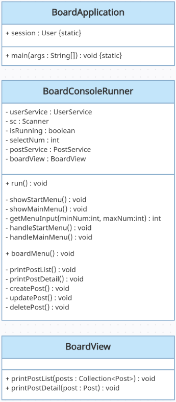
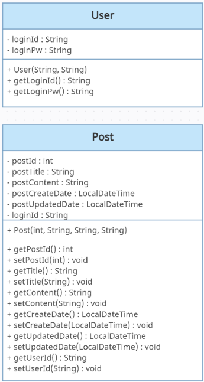
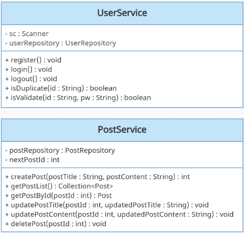
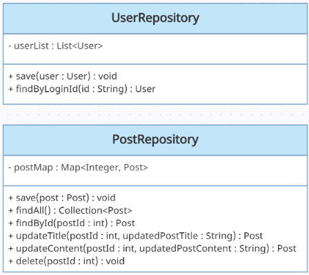

<h1 align="center">Team 구속성장💫 - JAVA CLI</h1>

<h2 align="center">1. 소개</h2>
<p align="center">자바 CLI기반 게시판 서비스로, 사용자의 회원가입 및 로그인을 제공합니다. <br />
로그인 수행 후, 제공되는 게시판에서 게시글을 작성·조회·수정·삭제(CRUD)의 작업을 수행할 수 있습니다. <br />
사용자 정보 및 게시글 데이터는 각각의 Repository에 저장됩니다. <br />
<br />
본 프로젝트는 Java 객체지향 설계와 로컬 데이터 관리를 통한 CRUD 처리 과정을 학습하는 것이 목표입니다.
</p>

<br />

<h2 align="center">2. 담당 기능 및 담당자</h2>
<h3 align="center">👤 사용자 관련 (User)</h3>
<table align="center" style="text-align:center";>
  <tr>
    <th>홍가현</th>
    <th>황보혜</th>
  </tr>
  <tr>
    <td>
      
    </td>
    <td>
      
    </td>
  </tr>
  <tr>
    <td>
      <a href="https://github.com/devken65">@devken65</a>
    </td>
    <td>
      <a href="https://github.com/hwangbohye03">@hwangbohye03</a>
    </td>
  </tr>
  <tr>
    <td>
      사용자 데이터 테이블 구축 <br />
      사용자 데이터 관련 메소드 및 로직 정의 <br />
      회원가입 기능
    </td>
    <td>
      러너 로직 구축 <br />
      로그인 & 로그아웃 기능
    </td>
  </tr>
</table>

<h3 align="center">📝 게시판 관련 (Post)</h3>
<table align="center" style="text-align:center";>
  <tr>
    <th>문창현</th>
    <th>이건희</th>
  </tr>
  <tr>
    <td>
      
    </td>
    <td>
      
    </td>
  </tr>
  <tr>
    <td>
      <a href="https://github.com/changhyunmoon">@changhyunmoon</a>
    </td>
    <td>
      <a href="https://github.com/Lee1sd">@Lee1sd</a>
    </td>
  </tr>
  <tr>
    <td>
      게시글 수정, 삭제 기능
    </td>
    <td>
      로그인 여부 확인 기능 <br />
      게시글 생성, 전체 조회, 상세 조회 기능
    </td>
  </tr>
</table>

<br />

<h2 align="center">3. 기능 정의</h2>
<h3 align="center">👤 USER</h3>
<table align="center" style="text-align: center;">
  <tr>
    <th>기능</th>
    <th>설명</th>
  </tr>
  <tr>
    <td>
      <strong>회원가입</strong>
    </td>
    <td>사용자 아이디와 비밀번호 입력 후 회원 정보 저장</td>
  </tr>
  <tr>
    <td>
      <strong>로그인</strong>
    </td>
    <td>사용자 아이디와 비밀번호 검증 후 로그인 상태로 변경</td>
  </tr>
  <tr>
    <td>
      <strong>로그아웃</strong>
    </td>
    <td>로그인 상태 해제</td>
  </tr>
</table>

<h3 align="center">📝 POST</h3>
<table align="center" style="text-align: center;">
  <tr>
    <th>기능</th>
    <th>설명</th>
  </tr>
  <tr>
    <td>
      <strong>게시글 작성</strong>
    </td>
    <td>제목과 내용을 입력 받아 로그인 사용자의 게시글 저장</td>
  </tr>
  <tr>
    <td>
      <strong>게시글 조회</strong>
    </td>
    <td>모든 게시글 리스트 조회</td>
  </tr>
  <tr>
    <td>
      <strong>게시글 상세 조회</strong>
    </td>
    <td>게시글 ID 입력 후 단일 게시글 조회</td>
  </tr>
  <tr>
    <td>
      <strong>게시글 수정</strong>
    </td>
    <td>게시글 ID 입력 후 제목과 내용을 수정</td>
  </tr>
  <tr>
    <td>
      <strong>게시글 삭제</strong>
    </td>
    <td>게시글 ID 입력 후 해당 게시글 삭제</td>
  </tr>
</table>

<br />

<h2 align="center">4. 폴더 구조</h2>

```java
.
└── 📂 Team9_JavaCLI/
    └── 📂 src/
        ├── 📦 runner/
        │   ├── BoardApplication.java        # 메인 (앱 실행)
        │   ├── BoardConsoleRunner.java      # 메뉴 입출력 
        │   └── BoardView.java               # 게시글 조회
        ├── 📦 domain/
        │   ├── User.java                    # 회원 엔티티
        │   └── Post.java                    # 게시글 엔티티
        ├── 📦 service/
        │   ├── UserService.java             # 회원가입, 로그인
        │   └── PostService.java             # 게시글 CRUD
        └── 📦 repository/
            ├── UserRepository.java          # User 테이블
            └── PostRepository.java          # Post 테이블
```
<br />

<h2 align="center">5. 설계</h2>
<table align="center" style="width:100%; text-align:center;">
  <!-- 제목 줄 -->
  <tr>
    <td width="25%"><h3>5-1. Runner</h3></td>
    <td width="25%"><h3>5-2. Domain</h3></td>
    <td width="25%"><h3>5-3. Service</h3></td>
    <td width="25%"><h3>5-4. Repository</h3></td>
  </tr>

  <!-- 이미지 줄 -->
  <tr valign="top">
    <td></td>
    <td></td>
    <td></td>
    <td></td>
  </tr>
</table>
<br />
<h2 align="center">6. Git 규칙</h2>

```java
git commit -m "<Type>: <Message>";
```
<table align="center" style="text-align: center;">
  <tr>
    <th>타입</th>
    <th>의미</th>
    <th>예시 상황</th>
  </tr>
  <tr>
    <td>feat</td>
    <td>새로운 기능 추가</td>
    <td>게시글 검색 기능 추가</td>
  </tr>
  <tr>
    <td>fix</td>
    <td>버그 수정</td>
    <td>로그인 오류 수정</td>
  </tr>
  <tr>
    <td>docs</td>
    <td>문서 수정 (README 등)</td>
    <td>README 업데이트</td>
  </tr>
  <tr>
    <td>style</td>
    <td>코드 스타일 변경 (기능 변화 없음)</td>
    <td>들여쓰기 수정, 세미콜론 정리</td>
  </tr>
  <tr>
    <td>refactor</td>
    <td>기능 변화 없이 코드 개선</td>
    <td>메소드 분리, 변수명 개선</td>
  </tr>
  <tr>
    <td>test</td>
    <td>테스트 코드 추가/수정</td>
    <td>회원가입 테스트 코드 작성</td>
  </tr>
  <tr>
    <td>comment</td>
    <td>주석만 수정</td>
    <td>메소드 설명 주석 추가</td>
  </tr>
  <tr>
    <td>rename</td>
    <td>파일/폴더 이름 변경</td>
    <td>UserService → MemberService</td>
  </tr>
  <tr>
    <td>remove</td>
    <td>파일 삭제</td>
    <td>사용 안 하는 클래스 삭제</td>
  </tr>
</table>
<br />
<h2 align="center">7. 실행 예시</h2>

```
-------------------------------------------------
프로그램을 실행하시겠습니까?
1. Yes
2. No
[번호 입력] >> 1


-------------------------------------------------
원하시는 실행 메뉴를 선택해주세요.
1. 프로그램 종료
2. 게시판 기능
3. 로그인
4. 회원가입
[번호 입력] >> 4

회원가입을 진행합니다
[사용자 아이디 입력] >> user
[사용자 비빌번호 입력] >> 1111

user님, 회원가입이 완료되었습니다


-------------------------------------------------
원하시는 실행 메뉴를 선택해주세요.
1. 프로그램 종료
2. 게시판 기능
3. 로그인
4. 회원가입
[번호 입력] >> 3

로그인을 진행합니다.
[사용자 아이디 입력] >> user
[사용자 비빌번호 입력] >> 1111

user님께서 로그인하셨습니다!


-------------------------------------------------
원하시는 실행 메뉴를 선택해주세요.
1. 프로그램 종료
2. 게시판 기능
3. 로그아웃
[번호 입력] >> 2

원하시는 게시판 기능을 선택해주세요.
1. 게시판 목록 조회
2. 게시글 상세 조회
3. 게시글 작성
4. 게시글 수정
5. 게시글 삭제
0. 뒤로가기
[번호 입력] >> 1
================ 📋 게시판 목록 =================
번호     작성자          제목                  
-------------------------------------------------
=================================================

원하시는 게시판 기능을 선택해주세요.
1. 게시판 목록 조회
2. 게시글 상세 조회
3. 게시글 작성
4. 게시글 수정
5. 게시글 삭제
0. 뒤로가기
[번호 입력] >> 3
user님의 게시글을 작성합니다.
[게시글 제목 입력] >> 테스트 게시글 제목
[게시글 내용 입력] >> 테스트 게시글 내용
게시글 작성을 완료하였습니다.
게시글 번호: 1

원하시는 게시판 기능을 선택해주세요.
1. 게시판 목록 조회
2. 게시글 상세 조회
3. 게시글 작성
4. 게시글 수정
5. 게시글 삭제
0. 뒤로가기
[번호 입력] >> 1
================ 📋 게시판 목록 =================
번호     작성자          제목                  
-------------------------------------------------
1      user         테스트 게시글 제목          
=================================================

원하시는 게시판 기능을 선택해주세요.
1. 게시판 목록 조회
2. 게시글 상세 조회
3. 게시글 작성
4. 게시글 수정
5. 게시글 삭제
0. 뒤로가기
[번호 입력] >> 4
수정할 게시글의 id를 입력해주세요 : 1
수정할 부분 선택 (1. 제목 / 2. 내용 / 0. 취소)
[번호 입력] >> 1
변경할 제목 입력 >> 테스트 게시글 제목(수정)
제목이 변경 되었습니다.
=============== 📄  1 번 게시글 상세 ===============
게시글 번호 : 1
작성자     : user
작성일     : 2026-02-26T22:37:45.888213
수정일     : 2026-02-26T22:38:24.632629600

<제목>
테스트 게시글 제목(수정)
<내용>
테스트 게시글 내용
=================================================

원하시는 게시판 기능을 선택해주세요.
1. 게시판 목록 조회
2. 게시글 상세 조회
3. 게시글 작성
4. 게시글 수정
5. 게시글 삭제
0. 뒤로가기
[번호 입력] >> 5
삭제할 게시글의 id를 입력해주세요 : 1
1번 게시글이 삭제되었습니다.

원하시는 게시판 기능을 선택해주세요.
1. 게시판 목록 조회
2. 게시글 상세 조회
3. 게시글 작성
4. 게시글 수정
5. 게시글 삭제
0. 뒤로가기
[번호 입력] >> 1
================ 📋 게시판 목록 =================
번호     작성자          제목                  
-------------------------------------------------
=================================================

원하시는 게시판 기능을 선택해주세요.
1. 게시판 목록 조회
2. 게시글 상세 조회
3. 게시글 작성
4. 게시글 수정
5. 게시글 삭제
0. 뒤로가기
[번호 입력] >> 0


-------------------------------------------------
원하시는 실행 메뉴를 선택해주세요.
1. 프로그램 종료
2. 게시판 기능
3. 로그아웃
[번호 입력] >> 3

user님께서 로그아웃되셨습니다!


-------------------------------------------------
원하시는 실행 메뉴를 선택해주세요.
1. 프로그램 종료
2. 게시판 기능
3. 로그인
4. 회원가입
[번호 입력] >> 1

프로그램을 종료합니다...
```


<h2 align="center">8. 테스트</h2>

### 1. 회원가입 [중복 아이디]
- **테스트 내용**: 이미 존재하는 ID `user`로 회원가입 시도  
- **기대 결과**: "이미 존재하는 아이디" 메시지 출력  
- **시연**:  
  


### 2. 로그인 [존재하지 않는 아이디]
- **테스트 내용**: 존재하지 않는 ID `user2`로 로그인 시도  
- **기대 결과**: "존재하지 않는 아이디" 메시지 출력  
- **시연**:  
  


### 3. 게시글 작성 [로그아웃 상태]
- **테스트 내용**: 로그아웃 상태에서 게시글 작성 시도  
- **기대 결과**: "로그인 후 사용 가능합니다." 메시지 출력  
- **시연**:  
  


### 4️. 게시글 수정 [로그아웃 상태]
- **테스트 내용**: 로그아웃 상태에서 게시글 수정 시도  
- **기대 결과**: "로그인 후 사용 가능합니다." 메시지 출력  
- **시연**:  
  


### 5️. 게시글 삭제 [로그아웃 상태]
- **테스트 내용**: 로그아웃 상태에서 게시글 삭제 시도  
- **기대 결과**: "로그인 후 사용 가능합니다." 메시지 출력  
- **시연**:  
  


